# Contextual Representation & Intervention

**A publication-safe research portfolio demonstrating a controlled representation-to-intervention workflow for context-sensitive language-model analysis.**

This repository is a public companion to an ongoing research project. It is designed to show the **technical scope, experimental logic, and reproducible engineering** of the work without disclosing manuscript-specific materials during peer review.

The public release uses only deterministic synthetic data and generalized labels. It does **not** contain the manuscript, submission venue, private prompts/stimuli, exact model identity, true experimental scale, manuscript-specific layer/subspace choices, empirical coefficients, paper figures, or inferential conclusions.

## What this project demonstrates

The private research workflow moves from controlled representational analysis to causal-style activation interventions while keeping development decisions separate from confirmation inference.

```mermaid
flowchart LR
    A[Controlled factorial inputs] --> B[Representation extraction]
    B --> C[Cross-form geometry]
    C --> D[Development-only selection]
    D --> E[Held-out confirmation]
    E --> F[Intervention basis construction]
    F --> G[Donor / ablation interventions]
    G --> H[Selectivity controls]
    H --> I[Bootstrap + randomization + LOO audit]
```



The public code provides generalized implementations of:

- deterministic development/confirmation splitting;
- vector normalization, cosine geometry, and cross-form directional alignment;
- family-level bootstrap confidence intervals;
- sign-randomization tests and standardized paired effects;
- leave-one-family-out robustness analysis;
- orthonormal subspace construction with energy-based rank selection;
- projection-based donor replacement;
- energy-matched partial ablation;
- synthetic end-to-end validation and unit tests.

## Why this repository is intentionally redacted

The underlying project is still unpublished. A normal full-reproduction release would reveal design details that can identify the manuscript or expose results before publication. This repository therefore follows a **portfolio-safe disclosure boundary**: the engineering pattern is public, but the manuscript-specific scientific payload remains private.

See [`docs/PUBLIC_RELEASE_SCOPE.md`](docs/PUBLIC_RELEASE_SCOPE.md) for the exact boundary.

## Repository layout

```text
src/contextual_mechanism/    reusable analysis utilities
scripts/                     executable synthetic demonstration
data/sample/                 synthetic family-level fixture
results/example/             example outputs from synthetic data
tests/                       unit tests for statistical/vector operations
docs/                        methods, disclosure scope, and portfolio summary
.github/workflows/            CI test configuration
```

## Quick start

```bash
python -m pip install -e ".[dev]"
python scripts/run_demo.py --output-dir results/generated
pytest -q
```

The demo writes:

```text
results/generated/
├── synthetic_effects.csv
├── inference_summary.json
├── intervention_summary.json
└── synthetic_effects.png
```

All generated values are synthetic and should **not** be interpreted as manuscript results.

## Technical components

### 1. Controlled representational geometry

The geometry module operates on paired directional representations from independently generated forms. It computes normalized direction vectors and cross-form alignment while preserving family-level grouping for inference.

### 2. Held-out statistical inference

The inference module implements grouped bootstrap intervals, sign-randomization, paired standardized effects, and leave-one-group-out sensitivity. These tools support decision rules that depend on **effect magnitude and stability**, not a single p-value.

### 3. Subspace construction

The intervention module builds orthonormal bases from development-only contrast vectors using SVD. A generalized energy threshold selects the smallest basis that captures a specified fraction of development variance.

### 4. Activation interventions

Two reusable operations are demonstrated:

- **donor replacement**: replace only the coordinates of a recipient vector that lie inside a selected subspace;
- **partial ablation**: shrink selected coordinates toward zero while leaving the orthogonal complement unchanged.

The synthetic demo also illustrates perturbation-energy matching for comparing intervention bases more fairly.

### 5. Robustness and selectivity

The workflow separates the focal intervention from matched/random controls and reports grouped uncertainty and leave-one-out stability. Exact manuscript-specific controls are intentionally withheld.

## Public-release design principles

| Principle | Public implementation | Withheld during review |
|---|---|---|
| Experimental control | General factorial schema | Real stimuli and lexical templates |
| Representation analysis | Reusable vector geometry | Exact model/layer choices |
| Confirmation logic | Deterministic held-out split | True family counts and split constants |
| Intervention analysis | Projection/subspace utilities | Manuscript-specific bases and readouts |
| Statistical inference | Bootstrap, randomization, LOO | Empirical estimates and decisions |
| Reproducibility | Synthetic demo + tests + CI | Private raw artifacts and paper figures |

## Suggested GitHub description

> Publication-safe portfolio of a controlled representation-to-intervention workflow for context-sensitive language-model analysis.

Suggested topics: `language-models`, `mechanistic-interpretability`, `representation-analysis`, `causal-interventions`, `statistical-inference`, `reproducible-research`, `python`.

## Citation

During peer review, cite this repository as software rather than as a numerical reproduction package. See [`CITATION.cff`](CITATION.cff).

## License

Code is released under the MIT License. Synthetic fixtures are released under CC0; see [`DATA_LICENSE.md`](DATA_LICENSE.md).
