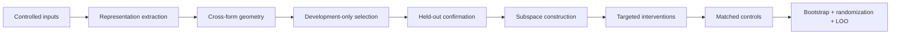

# ContextShift

**Probing and intervening on contextual representations in language models.**

ContextShift studies how controlled changes in context are reflected in internal language-model representations and how targeted changes to those representations affect downstream behavior. The project combines controlled experimental contrasts, representation geometry, held-out confirmation, low-dimensional subspace modeling, activation intervention, and robust statistical inference.

## Research workflow



The repository provides reusable implementations of:

- deterministic development/confirmation splitting;
- vector normalization, cosine geometry, and cross-form directional alignment;
- grouped bootstrap confidence intervals;
- sign-randomization tests and standardized paired effects;
- leave-one-group-out robustness analysis;
- orthonormal subspace construction with energy-based rank selection;
- projection-based donor replacement;
- energy-matched partial ablation;
- synthetic end-to-end validation and unit tests.

## Repository layout

```text
src/contextual_mechanism/    reusable analysis utilities
scripts/                     executable end-to-end demonstration
data/sample/                 synthetic family-level data
results/example/             example analysis outputs
tests/                       unit tests for statistical/vector operations
docs/                        methods and implementation notes
.github/workflows/           CI test configuration
```

## Quick start

```bash
python -m pip install -e ".[dev]"
python scripts/run_demo.py --output-dir results/generated
pytest -q
```

The demo produces:

```text
results/generated/
├── synthetic_effects.csv
├── inference_summary.json
├── intervention_summary.json
└── synthetic_effects.png
```

## Technical components

### 1. Controlled representational geometry

The geometry module operates on paired directional representations from independently generated forms. It computes normalized direction vectors, cosine similarity, and cross-form alignment while retaining group structure for downstream inference.

### 2. Held-out statistical inference

The inference module implements grouped bootstrap intervals, sign-randomization, paired standardized effects, and leave-one-group-out sensitivity. Development decisions and confirmation analyses are kept separate so that model-selection choices are not optimized on the final evaluation split.

### 3. Subspace construction

The intervention module builds orthonormal bases from development contrast vectors using singular value decomposition. Energy-based rank selection provides a compact representation of the dominant contrast structure.

### 4. Activation interventions

Two intervention operators are included:

- **donor replacement** — replaces the coordinates of a recipient vector that lie inside a selected subspace with the corresponding donor coordinates;
- **partial ablation** — attenuates selected coordinates while preserving the orthogonal complement.

The demonstration also includes perturbation-energy matching for more comparable intervention baselines.

### 5. Robustness and selectivity

The analysis workflow combines matched controls with grouped uncertainty estimation, randomization-based inference, standardized effects, and leave-one-group-out sensitivity checks. Together, these components test whether an observed representational pattern is stable and whether an intervention effect is selective rather than a consequence of generic perturbation.

## Example data

The repository includes deterministic synthetic data so the complete pipeline can be inspected and executed end to end. The example values are generated for demonstration and testing and are not empirical measurements.

Research-specific stimuli, model checkpoints, and study results are not distributed in this repository.

## Testing

Run the test suite with:

```bash
pytest -q
```

The tests cover deterministic splitting, vector geometry, statistical inference, subspace construction, and intervention operations.

## Citation

See [`CITATION.cff`](CITATION.cff).

## License

Code is released under the MIT License. Synthetic fixtures are released under CC0; see [`DATA_LICENSE.md`](DATA_LICENSE.md).
